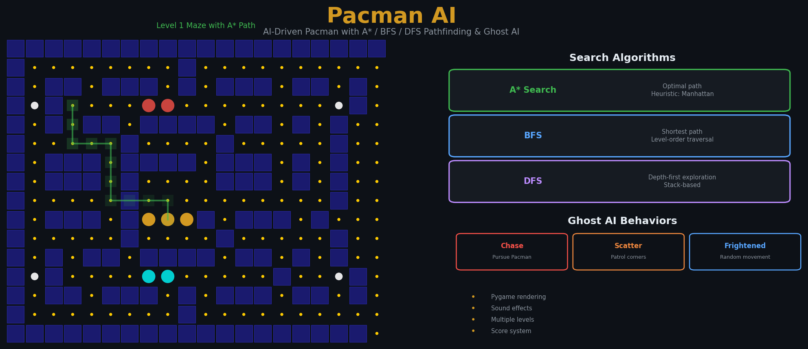

<p align="center">
  
</p>

# PACMAN AI Project

This project implements an AI-driven PACMAN game using Python and Pygame, featuring **A* / BFS / DFS pathfinding**, autonomous ghost AI with chase/scatter/frightened modes, and multiple maze levels.

## Setup

1. Create and activate virtual environment:
```bash
python -m venv venv
source venv/bin/activate  # On Windows: venv\Scripts\activate
```

2. Install requirements:
```bash
pip install -r requirements.txt
```

3. Run the game:
```bash
python main.py
```

## Project Structure

- `src/`: Source code
  - `agents/`: AI agent implementations
  - `algorithms/`: Search algorithm implementations
  - `environment/`: Game environment
  - `config/`: Game constants and settings
  - `utils/`: Utility functions
- `assets/`: Game resources
- `tests/`: Unit tests